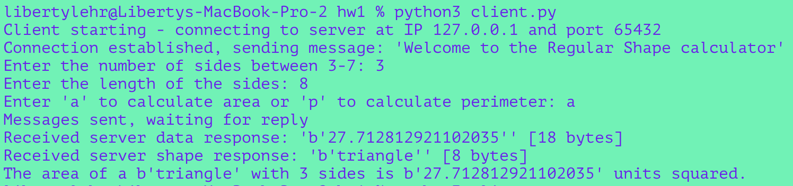
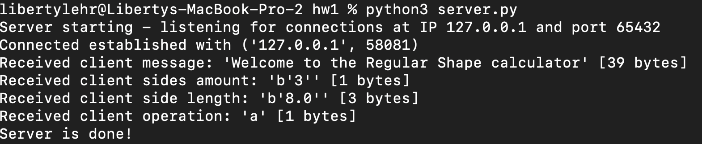

# Equilateral Triangle Calculator - Client-Server Message Format Documentation

## Overview of Application

### Purpose
The client-server application is designed to calculate properties (area or perimeter) of an equilateral triangle. The client sends information about the triangle's side length and the desired calculation (area or perimeter) to the server. The server performs the calculation and sends the result back to the client.

## Client->Server Message Format

### 1. Welcome Message
- **Description**: The client sends UTF-8 encoded welcome message to the server when establishing a connection. Not needed, but good for practice.
- **Example**:
  - Client sends: "Welcome to the Equilateral Triangle calculator."

### 2. Side Length
- **Description**: The client sends the length of the sides of the equilateral triangle as a float to the server.
- **Example**:
  - Client sends: "5.0" (encoded as a UTF-8 string).

### 3. Operation Selection
- **Description**: The client selects the operation they want to perform, 'a' for area or 'p' for perimeter, and sends it to the server.
- **Example**:
  - Client sends: "a" (encoded as a UTF-8 string).

### 4. Result Request
- **Description**: The client sends a request for the calculation result to the server.
- **Example**:
  - No data is sent; it's a signal to the server.

## Server->Client Message Format

### 1. Welcome Message
- **Description**: The server sends a UTF-8 encoded string, welcome message, to greet the client and inform them about the server's purpose.
- **Example**:
  - Server sends: "Welcome to the Equilateral Triangle calculator."

### 2. Side Length
- **Description**: The server receives the float, side length of the equilateral triangle from the client.
- **Example**:
  - Server receives: "5.0" (decoded from a UTF-8 string).

### 4. Result
- **Description**: The server calculates the requested result (either area or perimeter) and sends it to the client as a response.
- **Example**:
  - Server sends: "15.0" (encoded as a UTF-8 string) for the area calculation result.
  - Server sends: "Invalid choice" (encoded as a UTF-8 string) for an invalid operation.

## Example Output

### EX1
  1. Input Side Length: 4
  2. Input Operation: a
  3. Output: 6.9282

### EX2
  1. Input Side Length: 5
  2. Input Operation: p
  3. Output: 15

## Client Trace
  
  
## Server Trace
  

## Acknowledgments
Socket Programming in Python (Guide) by Nathan Jennings [https://realpython.com/python-sockets/]
