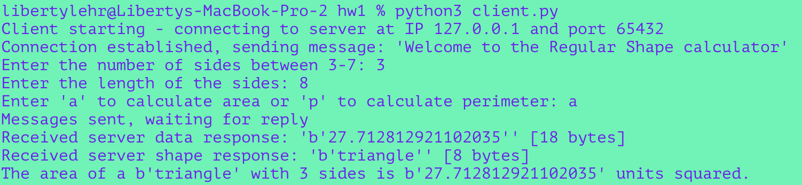

# Regular Shape Calculator - Client-Server Message Format Documentation

## Overview of Application

### Purpose
The client-server application is designed to calculate properties (area or perimeter) of regular shapes. The client sends information about the shape's side length and the desired calculation (area or perimeter) to the server. The server performs the calculation and sends the result back to the client.

## Example Output

### EX1
  1. Input Amount of Sides: 3
  2. Input Side Length: 4
  3. Input Operation: a
  4. Output: 6.9282

### EX2
  1. Input Amount of Sides: 3
  2. Input Side Length: 5
  3. Input Operation: p
  4. Output: 15

## Client Trace
  
  
## Server Trace
  

## Acknowledgments
Socket Programming in Python (Guide) by Nathan Jennings [https://realpython.com/python-sockets/]
